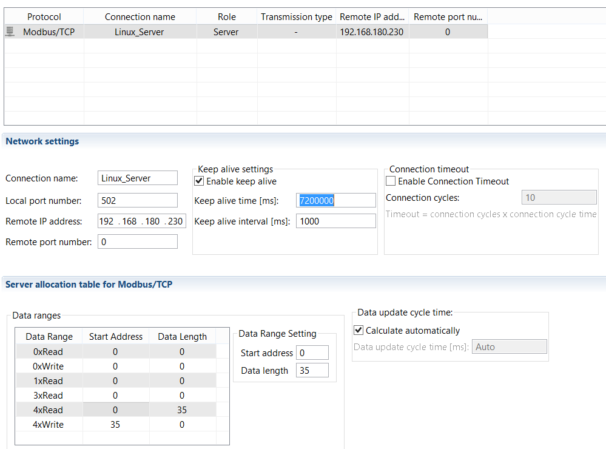

# GIS to TCS Interface

|                             |                          |
|-----------------------------|--------------------------|
| **Requested by:**           | **LSST**                 |
| **Doc. Code / Version nº:** | 7186_GIS_0008 / 2.0      |
| **Editor:**                 | F. Javier López          |
| **Approved by:**            | Ismael Ruiz de Argandoña |
| **Date:**                   | 2019/06/06               |

## INDEX

[1. Introduction [4](#introduction)](#introduction)

[2. Reference documents [4](#reference-documents)](#reference-documents)

[3. List of variables [4](#list-of-variables)](#list-of-variables)

[3.1 Subsystem -I/O decentralized- [5](#subsystem--io-decentralized-)](#subsystem--io-decentralized-)

[3.1.1 CPU [5](#cpu)](#cpu)

[3.1.2 AFE [7](#afe)](#afe)

[3.1.3 LAS [9](#las)](#las)

[3.1.4 M2C [11](#m2c)](#m2c)

[3.1.5 PFL [13](#pfl)](#pfl)

[3.2 Subsystems -CPUs- [15](#subsystems--cpus-)](#subsystems--cpus-)

[3.2.1 AUX [15](#aux)](#aux)

[3.2.2 DOME [17](#dome)](#dome)

[3.2.3 M1M3 [18](#m1m3)](#m1m3)

[3.2.4 TMA [19](#tma)](#tma)

[3.3 Safety matrix [21](#safety-matrix)](#safety-matrix)

[3.3.1 Causes [21](#causes)](#causes)

[3.3.2 Bypass [22](#bypass)](#bypass)

[3.3.3 Effects [23](#effects)](#effects)

[3.4 Others [25](#others)](#others)

[3.4.1 Acknowledge [25](#acknowledge)](#acknowledge)

## DOCUMENT HISTORY

<table>
<colgroup>
<col style="width: 11%" />
<col style="width: 16%" />
<col style="width: 20%" />
<col style="width: 51%" />
</colgroup>
<tbody>
<tr class="odd">
<td><strong>Version</strong></td>
<td><strong>Date</strong></td>
<td><strong>Author</strong></td>
<td><strong>Comments</strong></td>
</tr>
<tr class="even">
<td><strong>1.0</strong></td>
<td>2019/06/06</td>
<td><blockquote>

F. Javier López

</blockquote></td>
<td><blockquote>

<em>Initial Version</em>

</blockquote></td>
</tr>
<tr class="odd">
<td><strong>2.0</strong></td>
<td>2022/08/30</td>
<td><blockquote>

F. Javier López

</blockquote></td>
<td><blockquote>

<em>After review by Empresarios Agrupados</em>

</blockquote></td>
</tr>
<tr class="even">
<td></td>
<td></td>
<td></td>
<td></td>
</tr>
<tr class="odd">
<td></td>
<td></td>
<td></td>
<td></td>
</tr>
</tbody>
</table>

<table>
<colgroup>
<col style="width: 15%" />
<col style="width: 84%" />
</colgroup>
<thead>
<tr class="header">
<th><strong>Acronyms</strong></th>
<th><strong>Definition</strong></th>
</tr>
<tr class="odd">
<th>
AFE / AcFiEa

ETPB

CPU
</th>
<th>
Access Fire Earthquake

Emergency trip pushbutton

Control Programmable Unit
</th>
</tr>
<tr class="header">
<th>GIS</th>
<th>Global Interlock System</th>
</tr>
<tr class="odd">
<th>HMI</th>
<th>Human Machine Interface</th>
</tr>
<tr class="header">
<th>
IS

LAS
</th>
<th>
Interlock System

LASER
</th>
</tr>
<tr class="odd">
<th>
LSST

UI
</th>
<th>
Large Synoptic Survey Telescope

User Interface
</th>
</tr>
</thead>
<tbody>
</tbody>
</table>

## Introduction

The GIS provides a Modbus/TCP interface to transmit the status of all signals to the TCS. This communication has only
one direction, because it is not contemplated to receive any type of order or command from the TCS.

The installation and programming of this gateway is beyond the scope of this project, however, the Modbus memory map
used is provided for integration into the gateway.

## Reference documents

|        |                                                                      |                   |             |
|--------|----------------------------------------------------------------------|-------------------|-------------|
| **Nº** | **Document**                                                         | **Code**          | **Version** |
| **1**  | GLOBAL INTERLOCK SYSTEM (GIS) ANALYSIS                               | 092-308-E-Z-00004 | 4           |
| **2**  | Electrical schemes - 7186 LSST Global Safety Interlock System Design | *7186_GIS_0001*   | 1.0         |
| **3**  |                                                                      |                   |             |
| **4**  |                                                                      |                   |             |
| **5**  |                                                                      |                   |             |

## List of variables

The divisions are going to be carried out by subsystems and within each one of them there is a difference between the
physical and the state variables.

Another group will be those corresponding to the security matrix.

Finally, there will be an additional group that can not be classified in the previous ones.

In total 35 words of communication from 4x0000 up to 4x0034 are foreseen, where it has been tried to group by
functionalities and remaining free bits for possible extensions.

In principle, PC-Linux is configured as a server and with the indicated addresses, but can be changed depending on the
requirements.

### Subsystem -I/O decentralized-

#### CPU

| GIS CPU OUTPUT %Q\* Input CPU |           |              |      |                                          |
|-------------------------------|-----------|--------------|------|------------------------------------------|
| 4xRead 4x0000                 |           |              |      |                                          |
| 0                             | 4x0000.0  | sdiCPUetw1A  | E0.0 | Wireless Emergency pushbutton 1 channel1 |
| 1                             | 4x0000.1  | sdiCPUetw1B  | E0.1 | Wireless Emergency pushbutton 1 channel2 |
| 2                             | 4x0000.2  | sdiCPUetw2A  | E0.2 | Wireless Emergency pushbutton 2 channel1 |
| 3                             | 4x0000.3  | sdiCPUetw2B  | E0.3 | Wireless Emergency pushbutton 2 channel2 |
| 4                             | 4x0000.4  | sdiCPUfree1  | E1.0 | Reserve 1                                |
| 5                             | 4x0000.5  | sdiCPUfree2  | E1.1 | Reserve 2                                |
| 6                             | 4x0000.6  | sdiCPUfree3  | E1.2 | Reserve 3                                |
| 7                             | 4x0000.7  | sdiCPUfree4  | E1.3 | Reserve 4                                |
| 8                             | 4x0000.8  | sdiCPUfree5  | E2.0 | Reserve 5                                |
| 9                             | 4x0000.9  | sdiCPUfree6  | E2.1 | Reserve 6                                |
| 10                            | 4x0000.10 | sdiCPUfree7  | E2.2 | Reserve 7                                |
| 11                            | 4x0000.11 | sdiCPUfree8  | E2.3 | Reserve 8                                |
| 12                            | 4x0000.12 | sdiCPUfree9  | E2.4 | Reserve 9                                |
| 13                            | 4x0000.13 | sdiCPUfree10 | E2.5 | Reserve 10                               |
| 14                            | 4x0000.14 | sdiCPUpsr    | E2.6 | Power supply redundancy OK               |
| 15                            | 4x0000.15 | sdiCPUpsb    | E2.7 | Power supply balancing OK                |

| GIS CPU OUTPUT %Q\* Output CPU |           |               |      |                                       |
|--------------------------------|-----------|---------------|------|---------------------------------------|
| 4xRead 4x0001                  |           |               |      |                                       |
| 0                              | 4x0001.0  | sdoCPUetw1rst | A0.0 | Wireless emergency pushbutton 1 reset |
| 1                              | 4x0001.1  | sdoCPUetw2rst | A0.1 | Wireless emergency pushbutton 2 reset |
| 2                              | 4x0001.2  | sdoCPUfireA   | A1.0 | GIS Fire indication channel 1         |
| 3                              | 4x0001.3  | sdoCPUetw2rst | A1.1 | GIS Fire indication channel 1         |
| 4                              | 4x0001.4  | sdoCPUfree1   | A2.0 | Reserve 1                             |
| 5                              | 4x0001.5  | sdoCPUfree2   | A2.1 | Reserve 2                             |
| 6                              | 4x0001.6  |               |      |                                       |
| 7                              | 4x0001.7  |               |      |                                       |
| 8                              | 4x0001.8  |               |      |                                       |
| 9                              | 4x0001.9  |               |      |                                       |
| 10                             | 4x0001.10 |               |      |                                       |
| 11                             | 4x0001.11 |               |      |                                       |
| 12                             | 4x0001.12 |               |      |                                       |
| 13                             | 4x0001.13 |               |      |                                       |
| 14                             | 4x0001.14 |               |      |                                       |
| 15                             | 4x0001.15 |               |      |                                       |

| GIS CPU OUTPUT %Q\* Status CPU |           |     |     |     |
|--------------------------------|-----------|-----|-----|-----|
| 4xRead 4x0002                  |           |     |     |     |
| 0                              | 4x0002.0  |     |     |     |
| 1                              | 4x0002.1  |     |     |     |
| 2                              | 4x0002.2  |     |     |     |
| 3                              | 4x0002.3  |     |     |     |
| 4                              | 4x0002.4  |     |     |     |
| 5                              | 4x0002.5  |     |     |     |
| 6                              | 4x0002.6  |     |     |     |
| 7                              | 4x0002.7  |     |     |     |
| 8                              | 4x0002.8  |     |     |     |
| 9                              | 4x0002.9  |     |     |     |
| 10                             | 4x0002.10 |     |     |     |
| 11                             | 4x0002.11 |     |     |     |
| 12                             | 4x0002.12 |     |     |     |
| 13                             | 4x0002.13 |     |     |     |
| 14                             | 4x0002.14 |     |     |     |
| 15                             | 4x0002.15 |     |     |     |

#### AFE

| GIS CPU OUTPUT %Q\* Input AFE |           |               |        |                                              |
|-------------------------------|-----------|---------------|--------|----------------------------------------------|
| 4xRead 4x0003                 |           |               |        |                                              |
| 0                             | 4x0003.0  | sdiAFEetacA   | E100.0 | Emergency channel 1 from acces control       |
| 1                             | 4x0003.1  | sdiAFEetacB   | E100.1 | Emergency channel 2 from acces control       |
| 2                             | 4x0003.2  | sdiAFEetsfA   | E100.2 | Emergency channel 1 from summit fire control |
| 3                             | 4x0003.3  | sdiAFEetsfB   | E100.3 | Emergency channel 2 from summit fire control |
| 4                             | 4x0003.4  | sdiAFEeteaA   | E101.0 | Emergency channel 1 from earthquake control  |
| 5                             | 4x0003.5  | sdiAFEeteaB   | E101.1 | Emergency channel 2 from earthquake control  |
| 6                             | 4x0003.6  | sdiAFEupieraA | E101.2 | Unauthorized Pier Access channel1            |
| 7                             | 4x0003.7  | sdiAFEupieraB | E101.3 | Unauthorized Pier Access channel2            |
| 8                             | 4x0003.8  | sdiAFEudomeaA | E102.0 | Unauthorized Dome Access channel1            |
| 9                             | 4x0003.9  | sdiAFEudomeaB | E102.1 | Unauthorized Dome Access channel2            |
| 10                            | 4x0003.10 | sdiAFEfireA   | E102.2 | Fire interlock channel1                      |
| 11                            | 4x0003.11 | sdiAFEfireB   | E102.3 | Fire interlock channel2                      |
| 12                            | 4x0003.12 | sdiAFEfree1   | E103.0 | Reserve 1                                    |
| 13                            | 4x0003.13 | sdiAFEfree2   | E103.1 | Reserve 2                                    |
| 14                            | 4x0003.14 | sdiAFEpsr     | E103.2 | Power supply redundancy OK                   |
| 15                            | 4x0003.15 | sdiAFEpsb     | E103.3 | Power supply balancing OK                    |

| GIS CPU OUTPUT Output AFE |           |               |        |                                           |
|---------------------------|-----------|---------------|--------|-------------------------------------------|
| 4xRead 4x0004             |           |               |        |                                           |
| 0                         | 4x0004.0  | sdoAFEetacA   | A100.0 | Emergency channel1 to acces control       |
| 1                         | 4x0004.1  | sdoAFEetacB   | A100.1 | Emergency channel2 to acces control       |
| 2                         | 4x0004.2  | sdoAFEetsfA   | A101.0 | Emergency channel1 to summit fire control |
| 3                         | 4x0004.3  | sdoAFEetsfB   | A101.1 | Emergency channel2 to summit fire control |
| 4                         | 4x0004.4  | sdoAFEfree1   | A102.0 | Reserve1                                  |
| 5                         | 4x0004.5  | sdoAFEfree2   | A102.1 | Reserve2                                  |
| 6                         | 4x0004.6  | sdoAFEetacrst | A103.0 | Reset emergency to acces control          |
| 7                         | 4x0004.7  | sdoAFEetsfrst | A103.1 | Reset emergency to summit fire control    |
| 8                         | 4x0004.8  |               |        |                                           |
| 9                         | 4x0004.9  |               |        |                                           |
| 10                        | 4x0004.10 |               |        |                                           |
| 11                        | 4x0004.11 |               |        |                                           |
| 12                        | 4x0004.12 |               |        |                                           |
| 13                        | 4x0004.13 |               |        |                                           |
| 14                        | 4x0004.14 |               |        |                                           |
| 15                        | 4x0004.15 |               |        |                                           |

| GIS CPU OUTPUT %Q\* Status AFE |           |     |     |     |
|--------------------------------|-----------|-----|-----|-----|
| 4xRead 4x0005                  |           |     |     |     |
| 0                              | 4x0005.0  |     |     |     |
| 1                              | 4x0005.1  |     |     |     |
| 2                              | 4x0005.2  |     |     |     |
| 3                              | 4x0005.3  |     |     |     |
| 4                              | 4x0005.4  |     |     |     |
| 5                              | 4x0005.5  |     |     |     |
| 6                              | 4x0005.6  |     |     |     |
| 7                              | 4x0005.7  |     |     |     |
| 8                              | 4x0005.8  |     |     |     |
| 9                              | 4x0005.9  |     |     |     |
| 10                             | 4x0005.10 |     |     |     |
| 11                             | 4x0005.11 |     |     |     |
| 12                             | 4x0005.12 |     |     |     |
| 13                             | 4x0005.13 |     |     |     |
| 14                             | 4x0005.14 |     |     |     |
| 15                             | 4x0005.15 |     |     |     |

#### LAS

| GIS CPU OUTPUT %Q\* Input LAS |           |             |        |                                        |
|-------------------------------|-----------|-------------|--------|----------------------------------------|
| 4xRead 4x0006                 |           |             |        |                                        |
| 0                             | 4x0006.0  | sdiLASetA   | E200.0 | Emergency channel 1 from laser control |
| 1                             | 4x0006.1  | sdiLASetB   | E200.1 | Emergency channel 2 from laser control |
| 2                             | 4x0006.2  | sdiLASfree1 | E200.2 | Reserve 1                              |
| 3                             | 4x0006.3  | sdiLASfree2 | E200.3 | Reserve 2                              |
| 4                             | 4x0006.4  | sdiLASfree3 | E201.0 | Reserve 3                              |
| 5                             | 4x0006.5  | sdiLASfree4 | E201.1 | Reserve 4                              |
| 6                             | 4x0006.6  | sdiLASpsr   | E201.2 | Power supply redundancy OK             |
| 7                             | 4x0006.7  | sdiLASpsb   | E201.3 | Power supply balancing OK              |
| 8                             | 4x0006.8  |             |        |                                        |
| 9                             | 4x0006.9  |             |        |                                        |
| 10                            | 4x0006.10 |             |        |                                        |
| 11                            | 4x0006.11 |             |        |                                        |
| 12                            | 4x0006.12 |             |        |                                        |
| 13                            | 4x0006.13 |             |        |                                        |
| 14                            | 4x0006.14 |             |        |                                        |
| 15                            | 4x0006.15 |             |        |                                        |

| GIS CPU OUTPUT %Q\* Output LAS |           |             |        |                                     |
|--------------------------------|-----------|-------------|--------|-------------------------------------|
| 4xRead 4x0007                  |           |             |        |                                     |
| 0                              | 4x0007.0  | sdoLASetA   | A200.0 | Emergency channel1 to laser control |
| 1                              | 4x0007.1  | sdoLASetB   | A200.1 | Emergency channel2 to laser control |
| 2                              | 4x0007.2  | sdoLASfree1 | A201.0 | Reserve1                            |
| 3                              | 4x0007.3  | sdoLASfree2 | A201.1 | Reserve2                            |
| 4                              | 4x0007.4  | sdoLASetrst | A202.0 | Reset emergency to laser control    |
| 5                              | 4x0007.5  | sdoLASfree3 | A202.1 | Reserve3                            |
| 6                              | 4x0007.6  |             |        |                                     |
| 7                              | 4x0007.7  |             |        |                                     |
| 8                              | 4x0007.8  |             |        |                                     |
| 9                              | 4x0007.9  |             |        |                                     |
| 10                             | 4x0007.10 |             |        |                                     |
| 11                             | 4x0007.11 |             |        |                                     |
| 12                             | 4x0007.12 |             |        |                                     |
| 13                             | 4x0007.13 |             |        |                                     |
| 14                             | 4x0007.14 |             |        |                                     |
| 15                             | 4x0007.15 |             |        |                                     |

| GIS CPU OUTPUT %Q\* Status LAS |           |     |     |     |
|--------------------------------|-----------|-----|-----|-----|
| 4xRead 4x0008                  |           |     |     |     |
| 0                              | 4x0008.0  |     |     |     |
| 1                              | 4x0008.1  |     |     |     |
| 2                              | 4x0008.2  |     |     |     |
| 3                              | 4x0008.3  |     |     |     |
| 4                              | 4x0008.4  |     |     |     |
| 5                              | 4x0008.5  |     |     |     |
| 6                              | 4x0008.6  |     |     |     |
| 7                              | 4x0008.7  |     |     |     |
| 8                              | 4x0008.8  |     |     |     |
| 9                              | 4x0008.9  |     |     |     |
| 10                             | 4x0008.10 |     |     |     |
| 11                             | 4x0008.11 |     |     |     |
| 12                             | 4x0008.12 |     |     |     |
| 13                             | 4x0008.13 |     |     |     |
| 14                             | 4x0008.14 |     |     |     |
| 15                             | 4x0008.15 |     |     |     |

#### M2C

| GIS CPU OUTPUT %Q\* Input M2C |           |              |        |                                                 |
|-------------------------------|-----------|--------------|--------|-------------------------------------------------|
| 4xRead 4x0009                 |           |              |        |                                                 |
| 0                             | 4x0009.0  | sdiM2Cetm2aA | E400.0 | Emergency channel 1 from M2 actuators control   |
| 1                             | 4x0009.1  | sdiM2Cetm2aB | E400.1 | Emergency channel 2 from M2 actuators control   |
| 2                             | 4x0009.2  | sdiM2Cetm2hA | E400.2 | Emergency channel 1 from M2 hexapod control     |
| 3                             | 4x0009.3  | sdiM2Cetm2hB | E400.3 | Emergency channel 2 from M2 hexapod control     |
| 4                             | 4x0009.4  | sdiM2CetcrA  | E401.0 | Emergency channel 1 from camera rotator control |
| 5                             | 4x0009.5  | sdiM2CetcrB  | E401.1 | Emergency channel 2 from camera rotator control |
| 6                             | 4x0009.6  | sdiM2CetchA  | E401.2 | Emergency channel 1 from camera hexapod control |
| 7                             | 4x0009.7  | sdiM2CetchB  | E401.3 | Emergency channel 2 from camera hexapod control |
| 8                             | 4x0009.8  | sdiM2Cpinins | E402.0 | Camera rotator pin inserted                     |
| 9                             | 4x0009.9  | sdiM2Cfree1  | E402.1 | Reserve1                                        |
| 10                            | 4x0009.10 | sdiM2Cpsr    | E402.2 | Power supply redundancy OK                      |
| 11                            | 4x0009.11 | sdiM2Cpsb    | E402.3 | Power supply balancing OK                       |
| 12                            | 4x0009.12 |              |        |                                                 |
| 13                            | 4x0009.13 |              |        |                                                 |
| 14                            | 4x0009.14 |              |        |                                                 |
| 15                            | 4x0009.15 |              |        |                                                 |

| GIS CPU OUTPUT %Q\* Output M2C |           |                |        |                                              |
|--------------------------------|-----------|----------------|--------|----------------------------------------------|
| 4xRead 4x0010                  |           |                |        |                                              |
| 0                              | 4x0010.0  | sdoM2Cetm2aA   | A400.0 | Emergency channel1 to M2 actuators control   |
| 1                              | 4x0010.1  | sdoM2Cetm2aB   | A400.1 | Emergency channel2 to M2 actuators control   |
| 2                              | 4x0010.2  | sdoM2Cetm2hA   | A401.0 | Emergency channel1 to M2 hexapod control     |
| 3                              | 4x0010.3  | sdoM2Cetm2hB   | A401.1 | Emergency channel2 to M2 hexapod control     |
| 4                              | 4x0010.4  | sdoM2CetcrA    | A402.0 | Emergency channel1 to camera rotator control |
| 5                              | 4x0010.5  | sdoM2CetcrB    | A402.1 | Emergency channel2 to camera rotator control |
| 6                              | 4x0010.6  | sdoM2CetchA    | A403.0 | Emergency channel1 to camera hexapod control |
| 7                              | 4x0010.7  | sdoM2CetchB    | A403.1 | Emergency channel2 to camera hexapod control |
| 8                              | 4x0010.8  | sdoM2Cfree1    | A404.0 | Reserve1                                     |
| 9                              | 4x0010.9  | sdoM2Cfree2    | A404.1 | Reserve2                                     |
| 10                             | 4x0010.10 | sdoM2Cetm2arst | A405.0 | Reset emergency to M2 actuators control      |
| 11                             | 4x0010.11 | sdoM2Cetm2hst  | A405.1 | Reset emergency to M2 hexapod control        |
| 12                             | 4x0010.12 | sdoM2Cetcrrst  | A406.0 | Reset emergency to camera rotator control    |
| 13                             | 4x0010.13 | sdoM2Cetchrst  | A406.1 | Reset emergency to camera hexapod control    |
| 14                             | 4x0010.14 |                |        |                                              |
| 15                             | 4x0010.15 |                |        |                                              |

| GIS CPU OUTPUT %Q\* Status M2C |           |     |     |     |
|--------------------------------|-----------|-----|-----|-----|
| 4xRead 4x0011                  |           |     |     |     |
| 0                              | 4x0011.0  |     |     |     |
| 1                              | 4x0011.1  |     |     |     |
| 2                              | 4x0011.2  |     |     |     |
| 3                              | 4x0011.3  |     |     |     |
| 4                              | 4x0011.4  |     |     |     |
| 5                              | 4x0011.5  |     |     |     |
| 6                              | 4x0011.6  |     |     |     |
| 7                              | 4x0011.7  |     |     |     |
| 8                              | 4x0011.8  |     |     |     |
| 9                              | 4x0011.9  |     |     |     |
| 10                             | 4x0011.10 |     |     |     |
| 11                             | 4x0011.11 |     |     |     |
| 12                             | 4x0011.12 |     |     |     |
| 13                             | 4x0011.13 |     |     |     |
| 14                             | 4x0011.14 |     |     |     |
| 15                             | 4x0011.15 |     |     |     |

#### PFL

| GIS CPU OUTPUT %Q\* Input PFL |           |                  |        |                                                  |
|-------------------------------|-----------|------------------|--------|--------------------------------------------------|
| 4xRead 4x0012                 |           |                  |        |                                                  |
| 0                             | 4x0012.0  | sdiPFLetA        | E500.0 | Emergency channel 1 from Pflow&Auxiliary control |
| 1                             | 4x0012.1  | sdiPFLetB        | E500.1 | Emergency channel 2 from Pflow&Auxiliary control |
| 2                             | 4x0012.2  | sdiPFLmlnotpark  | E500.2 | Man Lift not parked                              |
| 3                             | 4x0012.3  | sdiPFLpllowlevel | E500.3 | Platform Lift above enclosure Lower Level        |
| 4                             | 4x0012.4  | sdiPFLplnotpark  | E501.0 | Platform Lift Not parked at the Telescope Level  |
| 5                             | 4x0012.5  | sdiPFLfree1      | E501.1 | Reserve1                                         |
| 6                             | 4x0012.6  | sdiPFLpsr        | E501.2 | Power supply redundancy OK                       |
| 7                             | 4x0012.7  | sdiPFLpsb        | E501.3 | Power supply balancing OK                        |
| 8                             | 4x0012.8  |                  |        |                                                  |
| 9                             | 4x0012.9  |                  |        |                                                  |
| 10                            | 4x0012.10 |                  |        |                                                  |
| 11                            | 4x0012.11 |                  |        |                                                  |
| 12                            | 4x0012.12 |                  |        |                                                  |
| 13                            | 4x0012.13 |                  |        |                                                  |
| 14                            | 4x0012.14 |                  |        |                                                  |
| 15                            | 4x0012.15 |                  |        |                                                  |

| GIS CPU OUTPUT %Q\* Output PFL |           |                  |        |                                     |
|--------------------------------|-----------|------------------|--------|-------------------------------------|
| 4xRead 4x0013                  |           |                  |        |                                     |
| 0                              | 4x0013.0  | sdoPFLetpflowA   | A500.0 | Emergency channel1 to Pflow control |
| 1                              | 4x0013.1  | sdoPFLetpflowB   | A500.1 | Emergency channel2 to Pflow control |
| 2                              | 4x0013.2  | sdoPFLetauxcA    | A501.0 | Emergency channel1 to Aux control   |
| 3                              | 4x0013.3  | sdoPFLetauxcB    | A501.1 | Emergency channel2 to Aux control   |
| 4                              | 4x0013.4  | sdoPFLmlSTOA     | A502.0 | STO Man Lift channel 1              |
| 5                              | 4x0013.5  | sdoPFLmlSTOB     | A502.1 | STO Man Lift channel 2              |
| 6                              | 4x0013.6  | sdoPFLetpflowrst | A503.0 | Reset emergency to Pflow control    |
| 7                              | 4x0013.7  | sdoPFLetauxcrst  | A503.1 | Reset emergency to Aux control      |
| 8                              | 4x0013.8  | sdoPFLmlrst      | A504.0 | Reset emergency to Man Lift control |
| 9                              | 4x0013.9  | sdoPFLfree1      | A504.1 | Reserve1                            |
| 10                             | 4x0013.10 |                  |        |                                     |
| 11                             | 4x0013.11 |                  |        |                                     |
| 12                             | 4x0013.12 |                  |        |                                     |
| 13                             | 4x0013.13 |                  |        |                                     |
| 14                             | 4x0013.14 |                  |        |                                     |
| 15                             | 4x0013.15 |                  |        |                                     |

| GIS CPU OUTPUT %Q\* Status PFL |           |     |     |     |
|--------------------------------|-----------|-----|-----|-----|
| 4xRead 4x0014                  |           |     |     |     |
| 0                              | 4x0014.0  |     |     |     |
| 1                              | 4x0014.1  |     |     |     |
| 2                              | 4x0014.2  |     |     |     |
| 3                              | 4x0014.3  |     |     |     |
| 4                              | 4x0014.4  |     |     |     |
| 5                              | 4x0014.5  |     |     |     |
| 6                              | 4x0014.6  |     |     |     |
| 7                              | 4x0014.7  |     |     |     |
| 8                              | 4x0014.8  |     |     |     |
| 9                              | 4x0014.9  |     |     |     |
| 10                             | 4x0014.10 |     |     |     |
| 11                             | 4x0014.11 |     |     |     |
| 12                             | 4x0014.12 |     |     |     |
| 13                             | 4x0014.13 |     |     |     |
| 14                             | 4x0014.14 |     |     |     |
| 15                             | 4x0014.15 |     |     |     |

### Subsystems -CPUs-

#### AUX

| GIS CPU OUTPUT %Q\* Input AUX |           |                        |     |                                           |
|-------------------------------|-----------|------------------------|-----|-------------------------------------------|
| 4xRead 4x0015                 |           |                        |     |                                           |
| 0                             | 4x0015.0  | gnetAUX.siplatliftabo  |     | Platform Lift above enclosure Lower Level |
| 1                             | 4x0015.1  | gnetAUX.siplatliftpark |     | Platform Lift Not Parked                  |
| 2                             | 4x0015.2  | gnetAUX.simanliftpark  |     | Man Lift Not Parked                       |
| 3                             | 4x0015.3  |                        |     |                                           |
| 4                             | 4x0015.4  |                        |     |                                           |
| 5                             | 4x0015.5  |                        |     |                                           |
| 6                             | 4x0015.6  |                        |     |                                           |
| 7                             | 4x0015.7  |                        |     |                                           |
| 8                             | 4x0015.8  |                        |     |                                           |
| 9                             | 4x0015.9  |                        |     |                                           |
| 10                            | 4x0015.10 |                        |     |                                           |
| 11                            | 4x0015.11 |                        |     |                                           |
| 12                            | 4x0015.12 |                        |     |                                           |
| 13                            | 4x0015.13 |                        |     |                                           |
| 14                            | 4x0015.14 |                        |     |                                           |
| 15                            | 4x0015.15 |                        |     |                                           |

| GIS CPU OUTPUT %Q\* Output AUX |           |                       |     |                                             |
|--------------------------------|-----------|-----------------------|-----|---------------------------------------------|
| 4xRead 4x0016                  |           |                       |     |                                             |
| 0                              | 4x0016.0  | gnetAUX.soplatlitfsto |     | Pflow Platform Lift Disable                 |
| 1                              | 4x0016.1  | gnetAUX.soplatlifttop |     | Pflow Platform Lift at/to top floor Disable |
| 2                              | 4x0016.2  |                       |     |                                             |
| 3                              | 4x0016.3  |                       |     |                                             |
| 4                              | 4x0016.4  |                       |     |                                             |
| 5                              | 4x0016.5  |                       |     |                                             |
| 6                              | 4x0016.6  |                       |     |                                             |
| 7                              | 4x0016.7  |                       |     |                                             |
| 8                              | 4x0016.8  |                       |     |                                             |
| 9                              | 4x0016.9  |                       |     |                                             |
| 10                             | 4x0016.10 |                       |     |                                             |
| 11                             | 4x0016.11 |                       |     |                                             |
| 12                             | 4x0016.12 |                       |     |                                             |
| 13                             | 4x0016.13 |                       |     |                                             |
| 14                             | 4x0016.14 |                       |     |                                             |
| 15                             | 4x0016.15 |                       |     |                                             |

#### DOME

| GIS CPU OUTPUT %Q\* Input DOME |           |                        |     |                                                       |
|-------|----------------|---------------------------------|------------|-----------------------------------------------------|
| 4xRead 4x0017                  |           |                        |     |                                                       |
| 0                              | 4x0017.0  | gnetDOME.silockingpin  |     | Dome Locking pin retracted or door louvers not closed |
| 1                              | 4x0017.1  | gnetDOME.sireardoor    |     | Dome rear door Not Closed                             |
| 2                              | 4x0017.2  | gnetDOME.sietpb        |     | Dome ETPB\'s                                          |
| 3                              | 4x0017.3  | gnetDOME.sicraneparked |     | Dome crane Not Parked                                 |
| 4                              | 4x0017.4  |                        |     |                                                       |
| 5                              | 4x0017.5  |                        |     |                                                       |
| 6                              | 4x0017.6  |                        |     |                                                       |
| 7                              | 4x0017.7  |                        |     |                                                       |
| 8                              | 4x0017.8  |                        |     |                                                       |
| 9                              | 4x0017.9  |                        |     |                                                       |
| 10                             | 4x0017.10 |                        |     |                                                       |
| 11                             | 4x0017.11 |                        |     |                                                       |
| 12                             | 4x0017.12 |                        |     |                                                       |
| 13                             | 4x0017.13 |                        |     |                                                       |
| 14                             | 4x0017.14 |                        |     |                                                       |
| 15                             | 4x0017.15 |                        |     |                                                       |

| GIS CPU OUTPUT %Q\* Output DOME |           |                          |     |                                          |
|---------------------------------|-----------|--------------------------|-----|------------------------------------------|
| 4xRead 4x0018                   |           |                          |     |                                          |
| 0                               | 4x0018.0  | gnetDOME.sowindscreensto |     | Dome doors and windscreen drives Disable |
| 1                               | 4x0018.1  | gnetDOME.socranesto      |     | Dome crane Disable                       |
| 2                               | 4x0018.2  | gnetDOME.solockingpinsto |     | Dome louvers and locking pin Disable     |
| 3                               | 4x0018.3  | gnetDOME.soreardoorsto   |     | Dome rear doors drives Disable           |
| 4                               | 4x0018.4  | gnetDOME.soazdrivesto    |     | Dome Azimuth drives Disable              |
| 5                               | 4x0018.5  |                          |     |                                          |
| 6                               | 4x0018.6  |                          |     |                                          |
| 7                               | 4x0018.7  |                          |     |                                          |
| 8                               | 4x0018.8  |                          |     |                                          |
| 9                               | 4x0018.9  |                          |     |                                          |
| 10                              | 4x0018.10 |                          |     |                                          |
| 11                              | 4x0018.11 |                          |     |                                          |
| 12                              | 4x0018.12 |                          |     |                                          |
| 13                              | 4x0018.13 |                          |     |                                          |
| 14                              | 4x0018.14 |                          |     |                                          |
| 15                              | 4x0018.15 |                          |     |                                          |

#### M1M3

| GIS CPU OUTPUT %Q\* Input M1M3 |           |                      |     |                      |
|--------------------------------|-----------|----------------------|-----|----------------------|
| 4xRead 4x0019                  |           |                      |     |                      |
| 0                              | 4x0019.0  | gnetM1M3.siinterlock |     | M1M3 interlock       |
| 1                              | 4x0019.1  | gnetM1M3.siheartbeat |     | M1M3 heartbeat input |
| 2                              | 4x0019.2  |                      |     |                      |
| 3                              | 4x0019.3  |                      |     |                      |
| 4                              | 4x0019.4  |                      |     |                      |
| 5                              | 4x0019.5  |                      |     |                      |
| 6                              | 4x0019.6  |                      |     |                      |
| 7                              | 4x0019.7  |                      |     |                      |
| 8                              | 4x0019.8  |                      |     |                      |
| 9                              | 4x0019.9  |                      |     |                      |
| 10                             | 4x0019.10 |                      |     |                      |
| 11                             | 4x0019.11 |                      |     |                      |
| 12                             | 4x0019.12 |                      |     |                      |
| 13                             | 4x0019.13 |                      |     |                      |
| 14                             | 4x0019.14 |                      |     |                      |
| 15                             | 4x0019.15 |                      |     |                      |

| GIS CPU OUTPUT %Q\* Output M1M3 |           |                      |     |                          |
|---------------------------------|-----------|----------------------|-----|--------------------------|
| 4xRead 4x0020                   |           |                      |     |                          |
| 0                               | 4x0020.0  | gnetM1M3.soheartbeat |     | M1M3 heartbeat output    |
| 1                               | 4x0020.1  | gnetM1M3.soearthsto  |     | M1M3 STO earthquake stop |
| 2                               | 4x0020.2  | gnetM1M3.soemergsto  |     | M1M3 STO emergency stop  |
| 3                               | 4x0020.3  |                      |     |                          |
| 4                               | 4x0020.4  |                      |     |                          |
| 5                               | 4x0020.5  |                      |     |                          |
| 6                               | 4x0020.6  |                      |     |                          |
| 7                               | 4x0020.7  |                      |     |                          |
| 8                               | 4x0020.8  |                      |     |                          |
| 9                               | 4x0020.9  |                      |     |                          |
| 10                              | 4x0020.10 |                      |     |                          |
| 11                              | 4x0020.11 |                      |     |                          |
| 12                              | 4x0020.12 |                      |     |                          |
| 13                              | 4x0020.13 |                      |     |                          |
| 14                              | 4x0020.14 |                      |     |                          |
| 15                              | 4x0020.15 |                      |     |                          |

#### TMA

| GIS CPU OUTPUT %Q\* Input TMA |           |                    |     |                                    |
|-------------------------------|-----------|--------------------|-----|------------------------------------|
| 4xRead 4x0021                 |           |                    |     |                                    |
| 0                             | 4x0021.0  | gnetTMA.sibrakeoff |     | TMA brakes not engaged             |
| 1                             | 4x0021.1  | gnetTMA.sipullcord |     | TMA CCW safety device activated    |
| 2                             | 4x0021.2  | gnetTMA.sietpb     |     | TMA ETPB\'s                        |
| 3                             | 4x0021.3  | gnetTMA.simcsfault |     | TMA Watchdog or loss communication |
| 4                             | 4x0021.4  |                    |     |                                    |
| 5                             | 4x0021.5  |                    |     |                                    |
| 6                             | 4x0021.6  |                    |     |                                    |
| 7                             | 4x0021.7  |                    |     |                                    |
| 8                             | 4x0021.8  |                    |     |                                    |
| 9                             | 4x0021.9  |                    |     |                                    |
| 10                            | 4x0021.10 |                    |     |                                    |
| 11                            | 4x0021.11 |                    |     |                                    |
| 12                            | 4x0021.12 |                    |     |                                    |
| 13                            | 4x0021.13 |                    |     |                                    |
| 14                            | 4x0021.14 |                    |     |                                    |
| 15                            | 4x0021.15 |                    |     |                                    |

| GIS CPU OUTPUT %Q\* Output TMA |           |                        |     |                                    |
|--------------------------------|-----------|------------------------|-----|------------------------------------|
| 4xRead 4x0022                  |           |                        |     |                                    |
| 0                              | 4x0022.0  | gnetTMA.sodischargecap |     | TMA discharge capacitor banks      |
| 1                              | 4x0022.1  | gnetTMA.soothersto     |     | TMA other equipments Disable       |
| 2                              | 4x0022.2  | gnetTMA.somainaxissto  |     | TMA main drives and brakes Disable |
| 3                              | 4x0022.3  | gnetTMA.soccwsto       |     | TMA CCW drives Disable             |
| 4                              | 4x0022.4  |                        |     |                                    |
| 5                              | 4x0022.5  |                        |     |                                    |
| 6                              | 4x0022.6  |                        |     |                                    |
| 7                              | 4x0022.7  |                        |     |                                    |
| 8                              | 4x0022.8  |                        |     |                                    |
| 9                              | 4x0022.9  |                        |     |                                    |
| 10                             | 4x0022.10 |                        |     |                                    |
| 11                             | 4x0022.11 |                        |     |                                    |
| 12                             | 4x0022.12 |                        |     |                                    |
| 13                             | 4x0022.13 |                        |     |                                    |
| 14                             | 4x0022.14 |                        |     |                                    |
| 15                             | 4x0022.15 |                        |     |                                    |

### Safety matrix

#### Causes

| GIS CPU OUTPUT %Q\* Causes/detection1 |           |              |     |                                                                 |
|--------|----------------|-------------------------|-------------|------------------------------------------------------------|
| 4xRead 4x0023                         |           |              |     |                                                                 |
| 0                                     | 4x0023.0  | gcauses.D_1  |     | Gis Fire Interlock                                              |
| 1                                     | 4x0023.1  | gcauses.D_2  |     | Catastrophic Earthquake Interlock                               |
| 2                                     | 4x0023.2  | gcauses.D_3  |     | Gis Internal Faillure                                           |
| 3                                     | 4x0023.3  | gcauses.D_4  |     | Gis ETPB\'s                                                     |
| 4                                     | 4x0023.4  | gcauses.D_5  |     | Unauthorized Pier Access                                        |
| 5                                     | 4x0023.5  | gcauses.D_6  |     | Unauthorized Dome Access                                        |
| 6                                     | 4x0023.6  | gcauses.D_7  |     | TMA Brakes Not engaged                                          |
| 7                                     | 4x0023.7  | gcauses.D_8  |     | Camera Cable Wrap Safety Device Actuated                        |
| 8                                     | 4x0023.8  | gcauses.D_9  |     | TMA ETPB\'s                                                     |
| 9                                     | 4x0023.9  | gcauses.D_10 |     | Dome Locking Pin retracted or Dome Rear Door Louvers Not closed |
| 10                                    | 4x0023.10 | gcauses.D_11 |     | Dome Rear doors are Not closed                                  |
| 11                                    | 4x0023.11 | gcauses.D_12 |     | Dome ETPB\'s                                                    |
| 12                                    | 4x0023.12 | gcauses.D_13 |     | Dome Crane not parked                                           |
| 13                                    | 4x0023.13 | gcauses.D_14 |     | Camera Rotator Pin Inserted                                     |
| 14                                    | 4x0023.14 | gcauses.D_15 |     | Platform Lift above Enclosure Lower Level                       |
| 15                                    | 4x0023.15 | gcauses.D_16 |     | Platform Lift Not parked at the Telescope Level                 |

| GIS CPU OUTPUT %Q\* Causes/detection2 |           |              |     |                                               |
|---------------------------------------|-----------|--------------|-----|-----------------------------------------------|
| 4xRead 4x0024                         |           |              |     |                                               |
| 0                                     | 4x0024.0  | gcauses.D_17 |     | Failed MCS Watchdog or MCS Loss communication |
| 1                                     | 4x0024.1  | gcauses.D_18 |     | M1M3 interlock                                |
| 2                                     | 4x0024.2  | gcauses.D_19 |     | Man Lift not parked                           |
| 3                                     | 4x0024.3  |              |     |                                               |
| 4                                     | 4x0024.4  |              |     |                                               |
| 5                                     | 4x0024.5  |              |     |                                               |
| 6                                     | 4x0024.6  |              |     |                                               |
| 7                                     | 4x0024.7  |              |     |                                               |
| 8                                     | 4x0024.8  |              |     |                                               |
| 9                                     | 4x0024.9  |              |     |                                               |
| 10                                    | 4x0024.10 |              |     |                                               |
| 11                                    | 4x0024.11 |              |     |                                               |
| 12                                    | 4x0024.12 |              |     |                                               |
| 13                                    | 4x0024.13 |              |     |                                               |
| 14                                    | 4x0024.14 |              |     |                                               |
| 15                                    | 4x0024.15 |              |     |                                               |

#### Bypass

| GIS CPU OUTPUT %Q\* Causes/detection1 bypass (override) |           |           |     |                                                                        |
|--------|----------------|-------------------------|-------------|------------------------------------------------------------|
| 4xRead 4x0025                                           |           |           |     |                                                                        |
| 0                                                       | 4x0025.0  | govr.D_1  |     | Bypass Gis Fire Interlock                                              |
| 1                                                       | 4x0025.1  | govr.D_2  |     | Bypass Catastrophic Earthquake Interlock                               |
| 2                                                       | 4x0025.2  | govr.D_3  |     | Bypass Gis Internal Faillure                                           |
| 3                                                       | 4x0025.3  | govr.D_4  |     | Bypass Gis ETPB\'s                                                     |
| 4                                                       | 4x0025.4  | govr.D_5  |     | Bypass Unauthorized Pier Access                                        |
| 5                                                       | 4x0025.5  | govr.D_6  |     | Bypass Unauthorized Dome Access                                        |
| 6                                                       | 4x0025.6  | govr.D_7  |     | Bypass TMA Brakes Not engaged                                          |
| 7                                                       | 4x0025.7  | govr.D_8  |     | Bypass Camera Cable Wrap Safety Device Actuated                        |
| 8                                                       | 4x0025.8  | govr.D_9  |     | Bypass TMA ETPB\'s                                                     |
| 9                                                       | 4x0025.9  | govr.D_10 |     | Bypass Dome Locking Pin retracted or Dome Rear Door Louvers Not closed |
| 10                                                      | 4x0025.10 | govr.D_11 |     | Bypass Dome Rear doors are Not closed                                  |
| 11                                                      | 4x0025.11 | govr.D_12 |     | Bypass Dome ETPB\'s                                                    |
| 12                                                      | 4x0025.12 | govr.D_13 |     | Bypass Dome Crane not parked                                           |
| 13                                                      | 4x0025.13 | govr.D_14 |     | Bypass Camera Rotator Pin Inserted                                     |
| 14                                                      | 4x0025.14 | govr.D_15 |     | Bypass Platform Lift above Enclosure Lower Level                       |
| 15                                                      | 4x0025.15 | govr.D_16 |     | Bypass Platform Lift Not parked at the Telescope Level                 |

| GIS CPU OUTPUT %Q\* Causes/detection2 bypass (override) |           |           |     |                                                      |
|--------|----------------|-------------------------|-------------|------------------------------------------------------------|
| 4xRead 4x0026                                           |           |           |     |                                                      |
| 0                                                       | 4x0026.0  | govr.D_17 |     | Bypass Failed MCS Watchdog or MCS Loss communication |
| 1                                                       | 4x0026.1  | govr.D_18 |     | Bypass M1M3 interlock                                |
| 2                                                       | 4x0026.2  | govr.D_19 |     | Bypass Man Lift not parked                           |
| 3                                                       | 4x0026.3  |           |     |                                                      |
| 4                                                       | 4x0026.4  |           |     |                                                      |
| 5                                                       | 4x0026.5  |           |     |                                                      |
| 6                                                       | 4x0026.6  |           |     |                                                      |
| 7                                                       | 4x0026.7  |           |     |                                                      |
| 8                                                       | 4x0026.8  |           |     |                                                      |
| 9                                                       | 4x0026.9  |           |     |                                                      |
| 10                                                      | 4x0026.10 |           |     |                                                      |
| 11                                                      | 4x0026.11 |           |     |                                                      |
| 12                                                      | 4x0026.12 |           |     |                                                      |
| 13                                                      | 4x0026.13 |           |     |                                                      |
| 14                                                      | 4x0026.14 |           |     |                                                      |
| 15                                                      | 4x0026.15 |           |     |                                                      |

#### Effects

| GIS CPU OUTPUT %Q\* Effects/actuation 1 |           |               |     |                                                  |
|-----------------------------------------|-----------|---------------|-----|--------------------------------------------------|
| 4xRead 4x0027                           |           |               |     |                                                  |
| 0                                       | 4x0027.0  | geffects.A_1  |     | Gis Fire Indication                              |
| 1                                       | 4x0027.1  | geffects.A_2  |     | Camera rotator pin inserted Indication           |
| 2                                       | 4x0027.2  | geffects.A_3  |     | TMA discharge Capacitors Bank                    |
| 3                                       | 4x0027.3  | geffects.A_4  |     | TMA disable Other equipment                      |
| 4                                       | 4x0027.4  | geffects.A_5  |     | TMA main drives -STO and engage the brakes       |
| 5                                       | 4x0027.5  | geffects.A_6  |     | Camera cable wrap drives STO                     |
| 6                                       | 4x0027.6  | geffects.A_7  |     | Dome shutter doors and Windscreen drives Disable |
| 7                                       | 4x0027.7  | geffects.A_8  |     | Dome crane Disable                               |
| 8                                       | 4x0027.8  | geffects.A_9  |     | Dome Louvers and Dome Locking pin Disable        |
| 9                                       | 4x0027.9  | geffects.A_10 |     | Dome Rear Doors drives Disable                   |
| 10                                      | 4x0027.10 | geffects.A_11 |     | Dome Azimuth drives Disable                      |
| 11                                      | 4x0027.11 | geffects.A_12 |     | STO M2 hexapods                                  |
| 12                                      | 4x0027.12 | geffects.A_13 |     | STO M2 actuators                                 |
| 13                                      | 4x0027.13 | geffects.A_14 |     | STO camera rotator                               |
| 14                                      | 4x0027.14 | geffects.A_15 |     | STO camera hexapod                               |
| 15                                      | 4x0027.15 | geffects.A_16 |     | Pflow Platform Lift Disable                      |

| GIS CPU OUTPUT %Q\* Effects/actuation 2 |           |               |     |                                             |
|-----------------------------------------|-----------|---------------|-----|---------------------------------------------|
| 4xRead 4x0028                           |           |               |     |                                             |
| 0                                       | 4x0028.0  | geffects.A_17 |     | Pflow Platform Lift at/to top floor Disable |
| 1                                       | 4x0028.1  | geffects.A_18 |     | STO M1M3 actuators (Earthquake stop)        |
| 2                                       | 4x0028.2  | geffects.A_19 |     | STO M1M3 actuators (Emergency stop)         |
| 3                                       | 4x0028.3  | geffects.A_20 |     | Laser Cut-off                               |
| 4                                       | 4x0028.4  | geffects.A_21 |     | Man Lift Disable                            |
| 5                                       | 4x0028.5  |               |     |                                             |
| 6                                       | 4x0028.6  |               |     |                                             |
| 7                                       | 4x0028.7  |               |     |                                             |
| 8                                       | 4x0028.8  |               |     |                                             |
| 9                                       | 4x0028.9  |               |     |                                             |
| 10                                      | 4x0028.10 |               |     |                                             |
| 11                                      | 4x0028.11 |               |     |                                             |
| 12                                      | 4x0028.12 |               |     |                                             |
| 13                                      | 4x0028.13 |               |     |                                             |
| 14                                      | 4x0028.14 |               |     |                                             |
| 15                                      | 4x0028.15 |               |     |                                             |

### Others

#### Acknowledge

| GIS CPU OUTPUT %Q\* Acknowledge |           |                   |     |                                                                |
|--------|----------------|-------------------------|--------------|-----------------------------------------------------------|
| 4xRead 4x0029                   |           |                   |     |                                                                |
| 0                               | 4x0029.0  | gack.CPUetw1rst   | CPU | Acknowledge CPU wireless 1 emergency pushbutton                |
| 1                               | 4x0029.1  | gack.CPUetw2rst   | CPU | Acknowledge CPU wireless 2 emergency pushbutton                |
| 2                               | 4x0029.2  | gack.AFEetacrst   | AFE | Acknowledge AFE emergency pushbutton to acces control          |
| 3                               | 4x0029.3  | gack.AFEetsfrst   | AFE | Acknowledge AFE emergency pushbutton to summit fire control    |
| 4                               | 4x0029.4  | gack.LASetrst     | LAS | Acknowledge LAS emergency pushbutton to laser control          |
| 5                               | 4x0029.5  | gack.M2Cetm2arst  | M2C | Acknowledge M2C emergency pushbutton to M2 actuators control   |
| 6                               | 4x0029.6  | gack.M2Cetm2hrst  | M2C | Acknowledge M2C emergency pushbutton to M2 hexapod control     |
| 7                               | 4x0029.7  | gack.M2Cetcrrst   | M2C | Acknowledge M2C emergency pushbutton to camera rotator control |
| 8                               | 4x0029.8  | gack.M2Cetchrst   | M2C | Acknowledge M2C emergency pushbutton to camera hexapod control |
| 9                               | 4x0029.9  | gack.PFLetflowrst | PFL | Acknowledge PFL emergency pushbutton to Pflow control          |
| 10                              | 4x0029.10 | gack.PFLetauxcrst | PFL | Acknowledge PFL emergency pushbutton to Aux control            |
| 11                              | 4x0029.11 | gack.PFLmlrst     | PFL | Acknowledge PFL emergency pushbutton to Man Lift control       |
| 12                              | 4x0029.12 |                   |     |                                                                |
| 13                              | 4x0029.13 |                   |     |                                                                |
| 14                              | 4x0029.14 |                   |     |                                                                |
| 15                              | 4x0029.15 |                   |     |                                                                |

| GIS CPU OUTPUT %Q\* |           |     |     |     |
|---------------------|-----------|-----|-----|-----|
| 4xRead 4x0030       |           |     |     |     |
| 0                   | 4x0030.0  |     |     |     |
| 1                   | 4x0030.1  |     |     |     |
| 2                   | 4x0030.2  |     |     |     |
| 3                   | 4x0030.3  |     |     |     |
| 4                   | 4x0030.4  |     |     |     |
| 5                   | 4x0030.5  |     |     |     |
| 6                   | 4x0030.6  |     |     |     |
| 7                   | 4x0030.7  |     |     |     |
| 8                   | 4x0030.8  |     |     |     |
| 9                   | 4x0030.9  |     |     |     |
| 10                  | 4x0030.10 |     |     |     |
| 11                  | 4x0030.11 |     |     |     |
| 12                  | 4x0030.12 |     |     |     |
| 13                  | 4x0030.13 |     |     |     |
| 14                  | 4x0030.14 |     |     |     |
| 15                  | 4x0030.15 |     |     |     |

| GIS CPU OUTPUT %Q\* |           |     |     |     |
|---------------------|-----------|-----|-----|-----|
| 4xRead 4x0031       |           |     |     |     |
| 0                   | 4x0031.0  |     |     |     |
| 1                   | 4x0031.1  |     |     |     |
| 2                   | 4x0031.2  |     |     |     |
| 3                   | 4x0031.3  |     |     |     |
| 4                   | 4x0031.4  |     |     |     |
| 5                   | 4x0031.5  |     |     |     |
| 6                   | 4x0031.6  |     |     |     |
| 7                   | 4x0031.7  |     |     |     |
| 8                   | 4x0031.8  |     |     |     |
| 9                   | 4x0031.9  |     |     |     |
| 10                  | 4x0031.10 |     |     |     |
| 11                  | 4x0031.11 |     |     |     |
| 12                  | 4x0031.12 |     |     |     |
| 13                  | 4x0031.13 |     |     |     |
| 14                  | 4x0031.14 |     |     |     |
| 15                  | 4x0031.15 |     |     |     |

| GIS CPU OUTPUT %Q\* |           |     |     |     |
|---------------------|-----------|-----|-----|-----|
| 4xRead 4x0032       |           |     |     |     |
| 0                   | 4x0032.0  |     |     |     |
| 1                   | 4x0032.1  |     |     |     |
| 2                   | 4x0032.2  |     |     |     |
| 3                   | 4x0032.3  |     |     |     |
| 4                   | 4x0032.4  |     |     |     |
| 5                   | 4x0032.5  |     |     |     |
| 6                   | 4x0032.6  |     |     |     |
| 7                   | 4x0032.7  |     |     |     |
| 8                   | 4x0032.8  |     |     |     |
| 9                   | 4x0032.9  |     |     |     |
| 10                  | 4x0032.10 |     |     |     |
| 11                  | 4x0032.11 |     |     |     |
| 12                  | 4x0032.12 |     |     |     |
| 13                  | 4x0032.13 |     |     |     |
| 14                  | 4x0032.14 |     |     |     |
| 15                  | 4x0032.15 |     |     |     |

| GIS CPU OUTPUT %Q\* |           |     |     |     |
|---------------------|-----------|-----|-----|-----|
| 4xRead 4x0033       |           |     |     |     |
| 0                   | 4x0033.0  |     |     |     |
| 1                   | 4x0033.1  |     |     |     |
| 2                   | 4x0033.2  |     |     |     |
| 3                   | 4x0033.3  |     |     |     |
| 4                   | 4x0033.4  |     |     |     |
| 5                   | 4x0033.5  |     |     |     |
| 6                   | 4x0033.6  |     |     |     |
| 7                   | 4x0033.7  |     |     |     |
| 8                   | 4x0033.8  |     |     |     |
| 9                   | 4x0033.9  |     |     |     |
| 10                  | 4x0033.10 |     |     |     |
| 11                  | 4x0033.11 |     |     |     |
| 12                  | 4x0033.12 |     |     |     |
| 13                  | 4x0033.13 |     |     |     |
| 14                  | 4x0033.14 |     |     |     |
| 15                  | 4x0033.15 |     |     |     |

| GIS CPU OUTPUT %Q\* |           |     |     |     |
|---------------------|-----------|-----|-----|-----|
| 4xRead 4x0034       |           |     |     |     |
| 0                   | 4x0034.0  |     |     |     |
| 1                   | 4x0034.1  |     |     |     |
| 2                   | 4x0034.2  |     |     |     |
| 3                   | 4x0034.3  |     |     |     |
| 4                   | 4x0034.4  |     |     |     |
| 5                   | 4x0034.5  |     |     |     |
| 6                   | 4x0034.6  |     |     |     |
| 7                   | 4x0034.7  |     |     |     |
| 8                   | 4x0034.8  |     |     |     |
| 9                   | 4x0034.9  |     |     |     |
| 10                  | 4x0034.10 |     |     |     |
| 11                  | 4x0034.11 |     |     |     |
| 12                  | 4x0034.12 |     |     |     |
| 13                  | 4x0034.13 |     |     |     |
| 14                  | 4x0034.14 |     |     |     |
| 15                  | 4x0034.15 |     |     |     |
